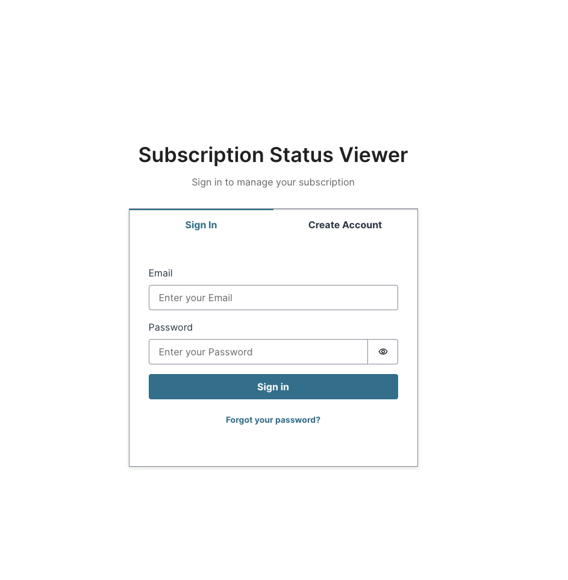
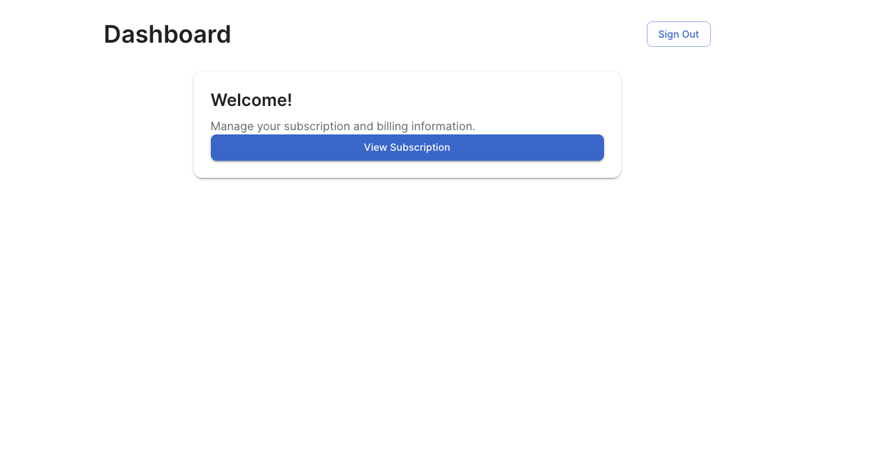
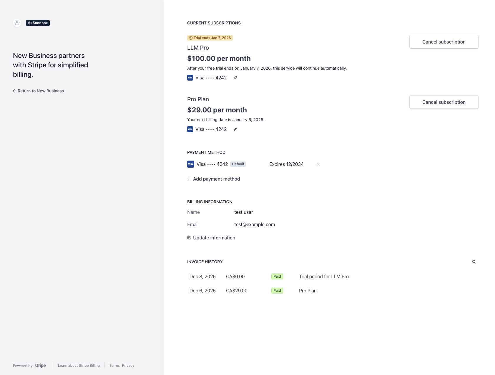
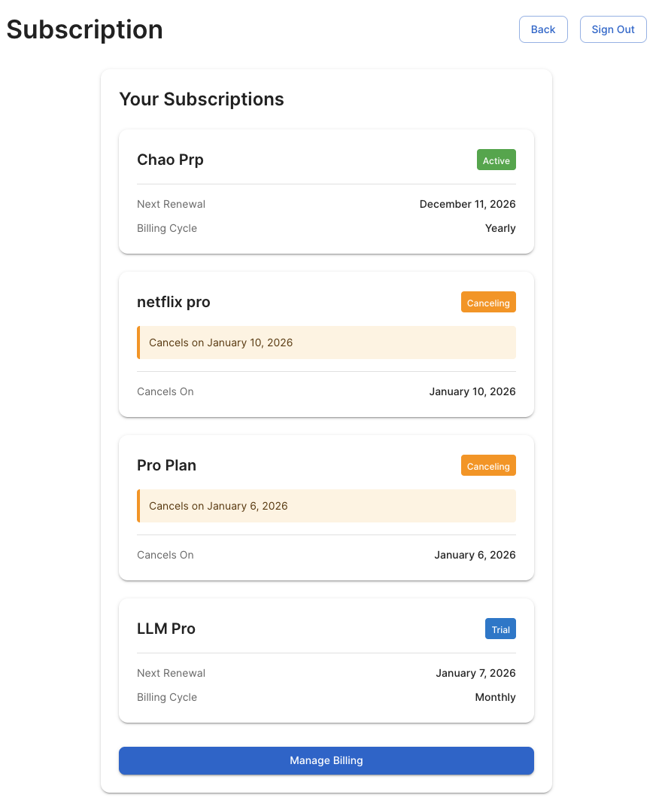

# Subscription Status Viewer

A full-stack web application for managing and viewing Stripe subscription statuses with AWS Amplify Gen 2 backend.

## 🚀 Features
- **User Authentication**: Secure login with AWS Cognito and protected routes

- **Subscription Management**: View current subscription status and plan details with support for multiple subscriptions

- **Billing Portal**: Direct integration with Stripe Customer Portal for managing payments

- **Real-time Updates**: Stripe webhook integration for instant subscription status changes

- **Dual-Layer Caching**: React Query in-memory cache + DynamoDB backend cache for optimal performance

- **Type-Safe**: Full TypeScript implementation across frontend and backend

## 🛠 Tech Stack
### Frontend

- **React 19** - UI framework

- **TypeScript** - Type safety

- **Material-UI (MUI) v7** - Component library

- **React Router v7** - Client-side routing

- **Vite** - Build tool and dev server
- **React Query (TanStack Query)** - Client-side data fetching and caching
### Backend

- **AWS Amplify Gen 2** - Backend infrastructure

- **AWS Lambda** - Serverless functions (Node.js 20)

- **AWS Cognito** - User authentication

- **AWS DynamoDB** - User-customer mapping and subscription cache

- **Stripe API** - Payment and subscription management

- **Stripe Webhooks** - Real-time subscription event handling

## 📸 Screenshots

### Login Page


### Dashboard


### Subscription Status


### Stripe Billing Portal Integration


### webhook response to real-time change



## 📁 Project Structure

```

subscription-status-viewer/

├── src/
│ ├── pages/ # Route components
│ │ ├── LoginPage.tsx
│ │ ├── DashboardPage.tsx
│ │ └── SubscriptionPage.tsx
│ ├── components/
│ │ ├── ui/ # Reusable UI components
│ │ │ ├── CposButton.tsx  # Button with loading state
│ │ │ ├── CposCard.tsx    # Standardized card container
│ │ │ ├── CposContainer.tsx    # Page container wrapper
│ │ │ ├── CposLoadingSpinner.tsx    # Loading indicator
│ │ │ ├── CposErrorMessage.tsx   # Error display with retry
│ │ │ ├── CposPageHeader.tsx   # Page title with actions
│ │ │ ├── CposBadge.tsx    # Status/category badges
│ │ │ ├── CposBox.tsx    # MUI Box wrapper
│ │ │ ├── CposText.tsx    # MUI Typography wrapper
│ │ │ ├── CposStack.tsx   # Vertical stack layout
│ │ │ ├── CposDivider.tsx    # Horizontal divider
│ │ │ ├── CposInfoRow.tsx    # Label-value pair display
│ │ │ ├── CposCardHeader.tsx    # Card header with action
│ │ │ ├── CposFlexBetween.tsx    # Flex space-between layout
│ │ │ └── index.ts    # Barrel exports
│ │ ├── views/ # Feature-specific components
│ │ │ └── SubscriptionStatus.tsx
│ │ └── ProtectedRoute.tsx # Authentication guard
│ ├── types/ # TypeScript definitions
│ │ ├── subscription.ts
│ │ ├── apiTpyes.ts
│ │ └── amplify.d.ts
│ ├── utils/ # Helper functions
│ │ └── utils.ts
│ ├── api/ # API client
│ │ └── apiEndpoints.ts
│ ├── hooks/ # Custom React hooks
│ │ └── useSubscription.ts
| | └── useSignOut.ts
│ ├── config/ # Configuration
│ │ └── amplify.ts      # AWS Amplify config
| | └── amplitude.ts    # Analytics initializatio
│ ├── App.tsx # Root component
│ ├── main.tsx # Entry point
│ └── theme.ts # MUI theme configuration
│
├── amplify/
│ ├── auth/ # Cognito configuration
│ │ └── resource.ts
│ ├── data/ # DynamoDB schema
│ │ └── resource.ts # UserStripeMapping & SubscriptionCache tables
│ ├── functions/
│ │ ├── get-subscription-status/
│ │ │ ├── handler.ts # Fetch subscription (with cache check)
│ │ │ ├── resource.ts
│ │ │ └── package.json
│ │ ├── cognito-post-confirmation/
│ │ │ ├── handler.ts          # Auto-create Stripe customer on signup
│ │ │ └── resource.ts         # Cognito trigger configuration
│ │ ├── create-billing-portal/
│ │ │ ├── handler.ts # Generate Stripe portal URL
│ │ │ ├── resource.ts # Lambda configuration
│ │ │ └── package.json
│ │ ├── stripe-webhook/
│ │ │ ├── handler.ts # Handle Stripe events
│ │ │ ├── resource.ts # Lambda with public URL
│ │ │ └── package.json
│ │ └── shared/ # Shared utilities
│ │ ├── auth-utils.ts # JWT validation
│ │ ├── stripe-client.ts # Stripe SDK singleton
│ │ ├── response-utils.ts # API response helpers
│ │ ├── dynamodb-utils.ts # DynamoDB operations
│ │ └── load-env.ts # Environment loader
│ ├── backend.ts # Main backend configuration
│ └── package.json
│
├── package.json
├── tsconfig.json
├── vite.config.ts
└── README.md

```

## 🏗 Architecture

```
┌─────────────────┐
│ User Browser │
└────────┬────────┘
│
▼
┌─────────────────┐
│ React App │
│ - Login Page │
│ - Dashboard │
│ - Subscription │
└────────┬────────┘
│
▼
┌────────────────────────────────┐
│ AWS Services │
│ │
│ │ │ AWS Cognito │ │
│ │ │ (Authentication) │ │
│ │ │ + Post-Confirmation │ │  ← Auto-creates Stripe customer
│ └──────────────────────────┘ │
│ │ │
│ ▼ │
│ ┌──────────────────────────┐ │
│ │ Amplify Functions │ │
│ │ - getSubscriptionStatus │ │
│ │ - createBillingPortal │ │
│ │ - stripeWebhook (public)│ │
│ └──────────────────────────┘ │
│ │ │
│ ▼ │
│ ┌──────────────────────────┐ │
│ │ DynamoDB │ │
│ │ - UserStripeMapping │ │
│ │ - SubscriptionCache │ │
│ └──────────────────────────┘ │
└──────────────┬─────────────────┘
│
▼
┌──────────────┐
│ Stripe API │◄──── Webhooks
│ (Test Mode) │
└──────────────┘

│ │ DynamoDB │ │
│ │ - UserStripeMapping │ │  ← Maps Cognito users to Stripe customers
│ │ - SubscriptionCache │ │  ← Caches subscription data 
```

## 🚦 Getting Started

 

### Prerequisites


- Node.js 20+ and npm

- AWS Account

- Stripe Account (Test mode)

- AWS Amplify CLI

 

### Installation

 

1. **Clone the repository**

   ```bash

   git clone <repository-url>

   cd Subscription-Status-Viewer

   ```


2. **Install dependencies**

   ```bash

   npm install

   ```
3. **Configure environment variables**
   
   Create a `.env` file in the root directory:
```env
   # Stripe Configuration
   STRIPE_SECRET_KEY=sk_test_xxxxx
   STRIPE_WEBHOOK_SECRET=whsec_xxxxx

   # Analytics (Optional)
   VITE_AMPLITUDE_API_KEY=your_amplitude_key_here
```
4. **Deploy Amplify backend**

   ```bash

   npx ampx sandbox

   ```
5. **Configure Stripe Webhook (after deployment)
After deploying, you'll get a webhook URL from the Amplify outputs:
* The webhook URL will be in the format:
* https://xxxxx.lambda-url.us-east-1.on.aws/

Configure this URL in your Stripe Dashboard:
* Go to: https://dashboard.stripe.com/test/webhooks
* Add an endpoint with the Lambda URL
* Select events: customer.subscription.*, invoice.paid, invoice.payment_failed
* Copy the webhook signing secret to your .env file

6. **Start development server**

   ```bash

   npm run dev

   ```
7. **Open browser**

   Navigate to `http://localhost:5173`
## 🔌 API Endpoints

### GET Subscription Status

Fetches the current subscription status for the authenticated user.
**Response:**
```typescript
{
  status: 'active' | 'trialing' | 'past_due' | 'canceled' | 'none',
  planName?: string,
  renewalDate?: string,
  renewalPeriod?: 'month' | 'year',
  cancelAtPeriodEnd?: boolean,
  subscriptions?: Array<{
    id: string,
    status: string,
    planName: string,
    renewalDate: string,
    renewalPeriod: string,
    cancelAtPeriodEnd?: boolean,
    cancelAt?: string
  }>,
  fromCache: boolean
}


```
### POST Create Billing Portal

Creates a Stripe Billing Portal session for the user.

**Request:**

```typescript

{

  returnUrl: string

}

```
**Response:**

```typescript

{

  url: string  // Stripe portal URL

}

```
### POST Stripe Webhook (Public Endpoint)
Receives webhook events from Stripe for real-time subscription updates.
```
customer.subscription.created
customer.subscription.updated
customer.subscription.deleted
invoice.paid
invoice.payment_failed
Security: Validates Stripe signature using STRIPE_WEBHOOK_SECRET
```

## 🔑 Key Design Decisions

### 1. Serverless Architecture

Four separate Lambda functions for different responsibilities:

- **get-subscription-status**: Fetch subscription data with caching
- **create-billing-portal**: Generate Stripe portal sessions
- **stripe-webhook**: Handle real-time Stripe events (public endpoint)
- **cognito-post-confirmation**: Auto-create Stripe customers on user signup


### 2. Dual-Layer Caching Strategy

**Frontend Caching (React Query):**
- In-memory cache for instant page loads
- Configurable cache time and stale-while-revalidate
- Automatic background refetching
- Smart retry logic (1 retry on failure)
- Disabled refetch on window focus for better UX
- Optimistic updates for seamless user experience

**Backend Caching (DynamoDB):**
- Persistent cache with 5-minute TTL
- Reduces Stripe API calls (rate limits & cost)
- Automatically invalidated by webhooks
- Falls back to Stripe API if cache is stale

**Cache Tables:**
- `SubscriptionCache`: Stores subscription status and details
- `UserStripeMapping`: Maps Cognito users to Stripe customers

### 3. Automated User Onboarding

**Cognito Post-Confirmation Trigger:**
- Automatically triggered when a new user signs up
- Creates a Stripe customer with the user's email
- Saves userId → stripeCustomerId mapping in DynamoDB
- Zero manual configuration required

**Flow:**
1. User completes signup in the app
2. Cognito triggers post-confirmation Lambda
3. Lambda creates a Stripe customer via API
4. Lambda saves mapping to the UserStripeMapping table
5. The user can immediately view subscription status

**Benefits:**
- **Seamless Onboarding**: No manual setup for new users
- **Data Consistency**: Single source of truth in DynamoDB
- **Scalability**: Handles unlimited users automatically
- **Error Handling**: Robust logging for troubleshooting

### 4. User Analytics with Amplitude

**Event Tracking:**
- Page views (Login, Dashboard, Subscription)
- User actions (Manage Billing clicked)
- Subscription data fetched events
- Custom properties for deeper insights

**Implementation:**
- Initialized on app startup
- Tracks key user interactions
- Optional: Gracefully disabled if API key not configured

**Benefits:**
- **Product Insights**: Understand user behavior patterns
- **Feature Usage**: Track which features are most used
- **Conversion Funnel**: Monitor user journey from login to billing


## 🔒 Security
- ✅ **Protected Routes**: ProtectedRoute component prevents unauthorized access to dashboard and subscription pages
- ✅ **Environment Variables**: Stripe secret keys stored server-side with runtime validation
- ✅ **CORS Configuration**: Configurable allowed origins via `ALLOWED_ORIGIN` environment variable
- ✅ **JWT Authentication**: All API calls authenticated via Cognito JWT tokens
- ✅ **User Isolation**: Users can only access their own subscription data (validated server-side)
- ✅ **IAM Permissions**: Lambda functions restricted to authenticated Cognito users only
- ✅ **HTTPS Enforced**: All communications encrypted in transit
- ✅ **No Client Secrets**: Stripe secret keys never exposed to frontend
- ✅ **Webhook Signature**: Verification: **: Ensures webhook events are from Stripe
- ✅ **Public Webhook Endpoint**: Uses signature validation instead of authentication
- ✅ **Client-Side Cache Isolation**: React Query caches scoped per user with automatic cleanup on logout
- ✅ **User-Scoped Cache Keys**: Query keys include userId to prevent cross-user data leaks
- ✅ **Per-Customer Backend Cache**: DynamoDB cache partitioned by stripeCustomerId
- ✅ **Automatic Cache Cleanup**: All cached data is cleared on sign-out to prevent data persistence


## 🧪 Development

### Available Scripts

```bash
npm run dev      # Start development server
npm run build    # Build for production
npm run preview  # Preview production build
npm run lint     # Run ESLint
```
### Code Style
- TypeScript for type safety
- ESLint for code quality
- Functional components with hooks
- Consistent file naming (PascalCase for components, camelCase for utilities)

## 📦 Build and Deploy

### Build for Production

```bash
npm run build
```
### Deploy to AWS
```bash
npx ampx sandbox delete  # Clean up sandbox
npx ampx pipeline-deploy --branch main  # Deploy to production
```
## 🔮 Future Enhancements
- [x] **Real-time Updates**: ✅ Implemented via Stripe webhooks
- [x] **Database Integration**: ✅ DynamoDB for mapping and caching
- [x] **Analytics**: ✅ Amplitude integration for tracking
- [x] **Automated User Onboarding**:✅ Cognito Post-Confirmation Trigger for auto-creating Stripe customers
---
## 👤 Author
**Chaohao Zhu**
Built with ❤️ using TypeScript, React, AWS Amplify, and Stripe
